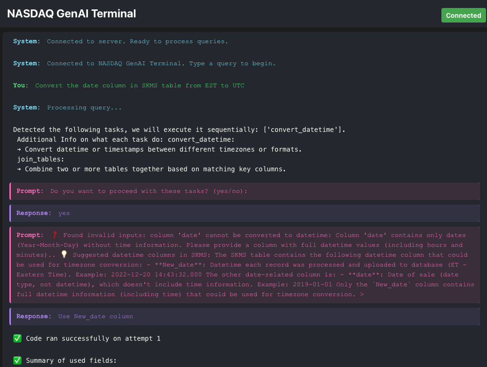

# ✅ NASDAQ GenAI Terminal



> Empowering Nasdaq’s Data Product Managers to Build Pipelines with Natural Language  
> _Built with FastAPI, LangGraph, DeepSeek-V3, OpenAI Embeddings, and React_

---

## 🚀 What is Nas1?

**Nas1** is Nasdaq’s first conversational data pipeline assistant. It helps non-technical users transform data using plain English instructions. From joining tables to timezone conversions, Nas1 automates repetitive engineering tasks so teams can focus on more complex data product development.

🏆 **Proven Impact**  
- 20-40% increase in engineering capacity  
- Up to 75% more data products onboarded  
- $6-8M in additional annual revenue potential

---

## ✨ Key Features

- 🗣️ **Natural Language Interaction**  
  Describe your data task in plain English.
- ⚙️ **Agentic Multi-Task Execution**  
  Specialized agents classify, validate, and execute your request.
- 🔄 **Human-in-the-Loop Confirmation**  
  Interactive prompts for safe and reliable execution.
- 🔍 **Real-Time Metadata Validation**  
  Powered by Retrieval-Augmented Generation (RAG).
- 🖥️ **Terminal-Style Web Interface**  
  Designed for finance professionals, no coding required.

---

## 🖼️ Example Interaction


> *"Convert the `New_date` column in SKMS.csv from US/Eastern to UTC."*  
Nas1 validates the schema, confirms your intent, generates Python code, and executes securely.

---

## 🏗️ Architecture Overview

- **Backend (FastAPI)**:  
  - WebSocket server for real-time interaction  
  - Modular agent system powered by DeepSeek-V3 and OpenAI Embeddings  
  - Secure execution of data transformations on synthetic datasets

- **Frontend (React)**:  
  - Terminal-style chat interface  
  - Interactive clarification prompts  
  - Real-time progress and results display

- **Communication (WebSocket)**:  
  - Bi-directional stateful messaging  
  - Session management and asynchronous updates

---

## 📦 Example Datasets

- `EFR.csv`: Stock price and volume data  
- `EQR.csv`: Extended stock data with timezone metadata  
- `SKMS.csv`: Market activity logs

> ⚠️ _Note: These are synthetic datasets used for safe prototyping._

---

## Model Architecture

- `state_schema.py`: Declared state fields that needs to be filled in
- `langgraph_implementation.py`: Workflow definition for langgraph nodes and edges
- `agent_functions.py`: All node/agent functions
- `main.py`: File to call if want to run program from terminal
- `start_fresh.sh`: File to call if want to run program from UI
  
---

## 🛠️ Installation Guide

### Prerequisites
- Python 3.10+
- Node.js 14+
- npm or yarn

### Setup Instructions
```bash
git clone https://github.com/yourusername/GenAI_Nasdaq.git
cd GenAI_Nasdaq
pip install -r requirements.txt
cd ui
npm install
cd ..
chmod +x start_fresh.sh
```

---

## 🚀 Launch the Application
```bash
./start_fresh.sh
```

- Open your browser at [http://localhost:3001](http://localhost:3001)

---

## 💬 Example Queries

1. **Convert Timezones**
   ```
   Convert the New_date column in SKMS.csv from US/Eastern to UTC timezone
   ```
2. **Join Tables**
   ```
   Join EFR.csv and EQR.csv on ticker and date columns
   ```
3. **Combined**
   ```
   Please convert the New_date column in the SKMS dataset from EST timezone to UTC timezone then join the new table with EFR based on ticker column
   ```

---

## 🧠 How It Works

1. **User Input** → Natural language task description  
2. **Task Classification** → Intent identified by DeepSeek-V3  
3. **Validation** → Metadata checked via RAG and user confirmation  
4. **Execution** → Python code generated and securely executed  
5. **Results** → Delivered instantly in the web interface

---

## 🛠️ Troubleshooting Tips

- Check logs in the `logs/` directory
- Ensure backend (port 9000) and frontend (port 3001) are running
- Use `127.0.0.1` if `localhost` fails to connect
- Safari users: Enable developer tools and disable CORS

---

## 🤝 Contributing

We welcome improvements! Please fork the repository and submit a Pull Request.

---

## 🙏 Acknowledgements

- Nasdaq for the opportunity to build this prototype
- OpenAI and DeepSeek for AI services
- FastAPI and React for powering the platform
- LangChain for enabling agentic workflow orchestration
